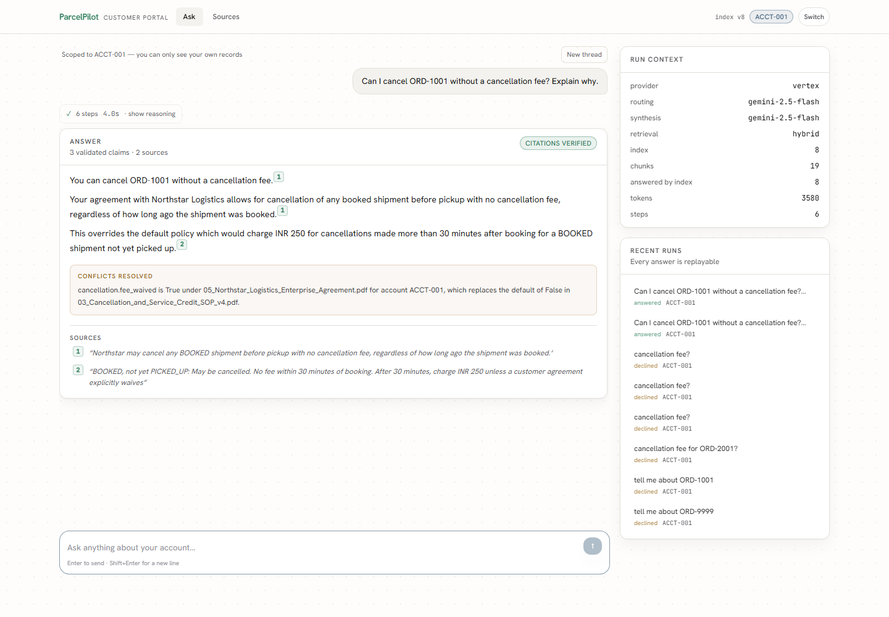
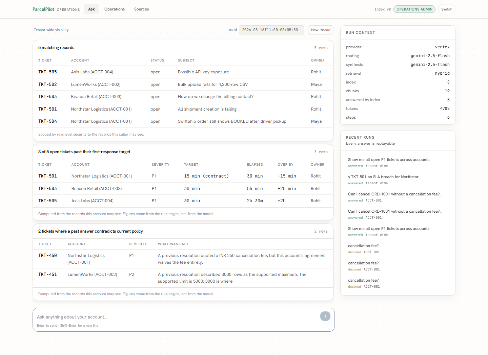

# ParcelPilot — Agentic Intelligence Infrastructure

Cited, verifiable reasoning over policies, contracts and operational data, with
tenancy enforced by the database rather than by application code.

Built for the Calquity AI Infrastructure Assessment.




*Customer portal.* The answer leads with the outcome, then cites the contract
clause **and** the standard policy it overrides — showing the conflict rather
than resolving it silently. `[1]` and `[2]` open the exact source paragraph. The
trace above it collapses to one line once the answer lands.



*Operations console.* A question about records is answered **with** the records.
Those figures come from the deterministic rule engine, not the model, and carry
no citation chips — because a database row is its own source. `15 min (contract)`
is the interesting cell: Northstar's agreement set that target, not the plan
default.

---

## The thesis

In high-stakes operations a fluently wrong answer costs more than no answer. So
every component is built so that being wrong is structurally hard and being
unsure is cheap:

| Guarantee | How it is enforced | Where |
|---|---|---|
| A customer cannot see another's data | PostgreSQL row-level security, non-owner runtime role | `migrations/001_init.sql` |
| Money is never computed by a model | Deterministic rules over typed columns | `agentcore/policy/rules.py` |
| Every claim traces to a source | Verbatim span validation before display | `agentcore/trust/validator.py` |
| Rules cannot drift from policy | Each parameter's quote re-located in the corpus, in CI | `policy_pack.yaml` |
| A superseded policy cannot be cited | Eligibility is a filter, not a weight | `agentcore/retrieval/hybrid.py` |
| Nothing changes without a human | Server-side action ledger, exactly-once, agent proposes only | `agentcore/tools/actions.py` |
| History cannot be rewritten | `UPDATE`/`DELETE` revoked from the runtime role | `migrations/001_init.sql` |

The strongest evidence is that the tests found real defects before users could:
a WIN1252 database that could not store `₹`, a missing RLS policy that allowed
tenant enumeration, commits silently dropping RLS scope, and policy clauses that
could never be cited.

---

## Where each assessment requirement is met

Both user contexts are built: a customer-facing chatbot and an internal
support/operations console, sharing one engine and one database. The brief asks
for either; supporting both is what makes the access-control claim demonstrable
rather than asserted — there is a real internal surface for customers to be
excluded from, and `migrations/006_internal_records_are_staff_only.sql` exists
because an audit found they were not.

| # | Requirement | Where it lives | How to see it |
|---|---|---|---|
| 1 | Chatbot, natural-language, supplied data only, differing source authority | `agentcore/orchestrator/`, `agentcore/retrieval/hybrid.py` | Ask "Can I cancel ORD-1001 without a cancellation fee?" — the answer cites the contract *and* the SOP it overrides |
| 1 | Confident answers handled, judgment cases escalated | `agentcore/trust/validator.py`, `_refuse` | Ask about German customs paperwork — it declines and offers a person |
| 2 | Access control in the **data layer**, not model instructions | `migrations/001_init.sql`, `agentcore/db/engine.py` | `tests/test_tenancy.py` issues deliberately **unfiltered** queries and asserts zero rows |
| 2 | Customers cannot reach other accounts | RLS + `app_names_foreign_account` | As ACCT-001 ask about ORD-2001 → declines in 631ms; ask about LumenWorks by name → declines in 47ms |
| 3 | Tool 1 — document search | `doc_search` | Hybrid FTS + dense, RRF fusion, eligibility gate |
| 3 | Tool 2 — structured lookup / calculation | `data_query`, `policy_decide` | Deterministic rules over typed columns; the model never does the arithmetic |
| 3 | Tool 3 — state-changing action | `prepare_action`, `agentcore/tools/actions.py` | Escalate a ticket, issue a credit, cancel an order, create a follow-up |
| 3+ | Two more, for a different question *shape* | `cohort_query`, `issue_scan` | "Is TKT-501 an SLA breach for Northstar?" answers from the same deterministic detectors the dashboard runs |
| 4 | Confirmation before execution | `actions.prepare` / `actions.confirm` | The client receives only an `action_id`; a second confirm returns 409, not a duplicate |
| 5 | Multi-step requests | the agent loop | ORD-1001 runs order lookup → account → agreement → SOP → fee calculation → answer, visible in the live trace |
| 6 | Chat interface showing which tool is used | `frontend/` | The reasoning stream is the durable run log being tailed, not a spinner. Collapses to `✓ 5 steps · 7.8s` when the answer lands |
| 7 | Demo video | `docs/DEMO_SCRIPT.md` | Script with timings |
| **P1** | Proactive issue detection | `agentcore/analytics/issues.py` | Six deterministic detectors, each finding cited: SLA breach, owed credit, overdue pickup, stale historical answer, recurring clusters |
| **P2** | Trust and reliability | the whole design | Eligibility gate, verbatim citation validation, deterministic policy engine, conflict surfacing, `policy validate` drift check in CI |

### Verified end to end

Every row above was exercised against live PostgreSQL 18.1 and live Vertex AI,
not asserted. The current gate:

```
190 Python tests · 16 frontend tests · 22/22 golden eval
schema at revision 8, no drift · 22 policy parameters re-located in the corpus
ruff clean · production build clean
```

Answers land in **1.5–5s** end to end. A cross-account refusal lands in **47ms**
with no model call at all, because the guard runs before the planner.

### The two example requests

```powershell
# "Can Northstar cancel ORD-1001 without a cancellation fee? Explain why."
python -m agentcore.cli ask "Can I cancel ORD-1001 without a cancellation fee?" \
    --account ACCT-001

# "A pickup is three hours late because of carrier fault. Should I get a credit?"
python -m agentcore.cli ask "A pickup for ORD-2002 is late because of carrier fault. Do we owe a credit, and how much?" \
    --account ACCT-002
```

Neither id is hard-coded anywhere. Both answers come from the loaded workbook and
the ingested PDFs; `policy_pack.yaml` carries every operative number with the
clause it was read from, and `policy validate` re-locates each quote in the live
corpus so a rule cannot drift from its source without failing CI.

---

## Quick start

```powershell
# 1. Install
python -m venv .venv
.\.venv\Scripts\python.exe -m pip install -e ".[dev,vertex]"
Copy-Item .env.example .env      # then fill in (see below)

# 2. Database  (bootstrap is the only step needing a superuser)
.\.venv\Scripts\python.exe -m agentcore.cli db bootstrap
.\.venv\Scripts\python.exe -m agentcore.cli db migrate

# 3. Model provider — verifies key, models and embedding dimension
.\.venv\Scripts\python.exe -m agentcore.cli llm probe

# 4. Build the index, then check the policy pack against it
.\.venv\Scripts\python.exe -m agentcore.cli ingest run
.\.venv\Scripts\python.exe -m agentcore.cli policy validate

# 5. Verify
.\.venv\Scripts\python.exe -m pytest tests/ -q                 # 190, real Postgres
.\.venv\Scripts\python.exe -m agentcore.cli eval run --offline  # 16, no model needed

# 6. Run — two processes
.\.venv\Scripts\python.exe -m uvicorn app.main:app --port 8000
cd frontend; npm install; npm run dev
```

Then open **http://localhost:5173**.

> Use `localhost`, not `127.0.0.1`. Vite binds the hostname, which on Windows
> resolves to IPv6 `::1`, so `http://127.0.0.1:5173` will not answer even though
> the server is up. The API itself is on `127.0.0.1:8000`, but you never need to
> hit it directly — Vite proxies `/api` through, which is also what keeps the
> bearer token on a same-origin request.

**Prerequisites:** Python 3.11+, Node 20+, and a running PostgreSQL 16+ (built
and verified against 18.1). `db bootstrap` is the only step that needs a
superuser connection; nothing at request time does.

### Before a demo, reset the dataset

```powershell
.\.venv\Scripts\python.exe -m agentcore.cli db reset-demo
```

Exercising the action ledger really does change data — that is the point of it.
So a session of testing leaves TKT-501 `escalated`, ORD-1001 `CANCELLED`, credits
issued and approvals queued, and **nothing fails at the time**. The damage shows
up later and elsewhere: the SLA detector stops flagging a ticket that is no
longer open, and the dashboard shows two breaches where the workbook has three.

The worst version is the demo itself. The flagship question is "can I cancel
ORD-1001?" and the headline internal flow is "escalate TKT-501". Against leftover
state the system answers *correctly about the wrong world*, which is exactly what
makes it hard to notice. `conftest._protect_real_dataset` covers pytest; it
cannot cover a script run by hand, so the restore is a command.

The audit log is deliberately **not** cleared — it is append-only by permission,
and a reset that could rewrite history would contradict the guarantee it exists
to demonstrate.

### If setup goes wrong

| Symptom | Cause | Fix |
|---|---|---|
| `db bootstrap` refuses to run | The target database is not UTF-8 | Intentional. A WIN1252 database physically cannot store `₹` or an em-dash, and the corpus is full of both. Let bootstrap create the database rather than pointing it at an existing one |
| `llm probe` exits non-zero | No credential, or more than one set | Precedence is `GOOGLE_APPLICATION_CREDENTIALS` → `VERTEX_ACCESS_TOKEN` → `LLM_API_KEY`, **first set wins** — blank the others |
| Answers refuse with `no_eligible_source` | No index | Run `ingest run`. Readiness means "an index is pinned and loadable" |
| `policy validate` fails | A quote no longer appears in the corpus it cites | Working as intended: a rule has drifted from its source. Fix the pack or the document, not the check |
| `db status` exits non-zero | An applied migration was edited | Checksums make drift fatal. Add a new migration; never edit an applied one |
| Frontend loads, answers never arrive | Backend not running, or reached on the wrong host | Check `curl http://localhost:5173/api/meta` — that is the path the browser actually uses |

### Environment

Minimum for a working system:

```
DATABASE_URL=postgresql://parcelpilot_app:<password>@127.0.0.1:5432/parcelpilot
ADMIN_DATABASE_URL=postgresql://postgres:<password>@127.0.0.1:5432/postgres

LLM_PROVIDER=vertex
VERTEX_PROJECT=<gcp-project-id>
VERTEX_LOCATION=us-central1
GOOGLE_APPLICATION_CREDENTIALS=./.secrets/vertex-sa.json
```

Credentials are checked in order and the **first one set wins**, so blank the
others: `GOOGLE_APPLICATION_CREDENTIALS` → `VERTEX_ACCESS_TOKEN` → `LLM_API_KEY`.

Without a model the system still boots: retrieval degrades to lexical-only and
the engine refuses to synthesise rather than guessing. That mode is tested, not
incidental.

---

## Try it from the CLI

```powershell
# The flagship question. The snapshot timestamp reproduces the dataset's instant.
.\.venv\Scripts\python.exe -m agentcore.cli ask `
  "Can Northstar cancel ORD-1001 without a cancellation fee? Explain why." `
  --account ACCT-001 --as-of "2026-08-16T11:00:00+05:30"

# Deterministic policy verdicts, no model involved
.\.venv\Scripts\python.exe -m agentcore.cli policy decide --order ORD-2002 `
  --rule failed_pickup_credit --as-of "2026-08-16T11:00:00+05:30"

# Parameters in force for an account, with provenance
.\.venv\Scripts\python.exe -m agentcore.cli policy show --account ACCT-001
```

---

## Architecture

```
ingest (offline, owner role)          serve (stateless, app role)
  PDF  -> section-aligned chunks        route   -- model picks tools
  XLSX -> typed rows (declared map)     execute -- SQL + deterministic rules
  embed -> immutable index version      synthesise -- structured claims only
  flip  -> active, atomically           validate -- verbatim spans, or refuse
                                        stream  -- SSE tails the durable log
```

- **`agentcore/`** — domain-agnostic engine: types, db, ingestion, retrieval,
  policy, trust, llm, tools, orchestrator, analytics
- **`app/`** — FastAPI: auth, chat + SSE, dashboard, actions
- **`frontend/`** — React console in the Calquity visual language
- **`eval/`** — golden set and harness
- **`policy_pack.yaml`** — every operative number, with the clause it came from

Ingestion is a separate command, never a startup hook. That is what makes the
server horizontally scalable: a process serving requests never mutates the
index, so N replicas cannot race, and readiness means "an index is pinned"
rather than "wait while I parse PDFs".

### Documentation

| Document | What it covers |
|---|---|
| `docs/TECHNICAL_DECISIONS.md` | Every decision and its rationale, what was rejected, and the defects the build surfaced — including the ones an external audit found that the test suite structurally could not |
| `docs/DEMO_SCRIPT.md` | 6-minute walkthrough script, with a fallback if the model credential is down |
| `docs/ARCHITECTURE.md` | Architecture note |
| `docs/PRODUCT.md` | Product note: both client problems, roadmap, what was left out, the metric, AI tool usage |
| `docs/CHATBOT_QUESTIONS.md` | The question catalog every release is run against by hand |
| `docs/ACTION_AGENT_GUIDE.md` | The action ledger and why an agent never executes directly |
| `CLAUDE.md` | Invariants, working agreements, hard-won operational facts |
| `policy_pack.yaml` | Every operative number with the clause it came from |

---

## Testing

```powershell
pytest tests/ -q                                    # 190 tests, real Postgres
python -m agentcore.cli eval run --offline          # CI gate: deterministic
python -m agentcore.cli eval run                    # adds live-model cases
python -m agentcore.cli db status                   # non-zero on schema drift
python -m agentcore.cli policy validate             # non-zero on policy drift
cd frontend && npm test                             # 16 tests: SSE wire framing
```

The eval split matters. Offline cases — policy verdicts, retrieval ranking,
tenancy isolation — are deterministic, free and fast, so they gate every commit.
Online cases need a live model and run before a release. A pipeline that needed
an API key to test tenancy would end up disabled.

Tenancy failures exit with code **2** rather than 1: a leak is a security
incident, not a percentage point.

---

## What is deliberately not here

- **Text-to-SQL** — the template registry is the whole allowed query surface.
  (Worth revisiting at scale: with RLS, a read-only role and statement timeouts,
  guarded SQL for *exploration* becomes defensible. Decisions stay with the rule
  engine.)
- **A universal spreadsheet loader** — the mapping is declared, not inferred,
  because the policy engine reads `orders.booked_at` by name and a shape-shifting
  schema cannot support a rule that must answer the same way twice.
- **pgvector** — not installed on the target host and not load-bearing at this
  corpus size. Dense retrieval uses `float4[]` with exact cosine behind an
  interface that swaps in one place.
- **Fine-tuning** — retrieval plus deterministic tools gives higher precision and
  zero retraining latency when a policy changes.

## Known limitations

Listed because an evaluator will find them, and finding them listed is better
than finding them.

- **Some purely data-shaped questions are fragile.** "Show me all open P1
  tickets across accounts" answers when the detectors return findings, because a
  finding carries the threshold clause that makes it citable. A question with no
  governing clause at all and no findings has nothing quotable and will decline —
  every claim needs a verbatim document quote and a bare table row has none. The
  durable fix is to render rows as a server-authored table beside the answer, the
  way `runs.action_notice` already carries a fact the model may not claim.
- **The flagship golden case is phrasing-sensitive.** `answer-northstar-no-fee`
  asks "Can **Northstar** cancel ORD-1001…" and currently cites only the
  contract, so the golden set sits at 21/22. Ask the same thing as "Can **I**
  cancel ORD-1001 without a cancellation fee? Explain why." and it cites the
  contract *and* the ₹250 default it overrides, with the conflict block — the
  screenshot above is that answer. Naming the company appears to anchor the model
  on that company's agreement. Retrieval is not the cause: the SOP is the
  top-ranked candidate and is selected either way.
- **Verbatim validation cannot cite a flattened table.** The SLA table extracts
  column-major (`Plan / P1 / P2 / P3 / Enterprise / 30 minutes...`), so a
  row-and-column intersection the model reconstructs correctly is not a
  contiguous span. It survives today because two of three claims validate and
  partial acceptance keeps them; the real fix is emitting tables row-wise at
  ingest.
- **No conversation memory.** Threading is durable in the database but nothing
  from earlier turns reaches the agent, so "what about that one?" starts over.
  Deliberately absent rather than half-built: the router decides both tool
  selection *and* action staging, so a pronoun resolving from history would put
  an unverified record id into the action gate. The right shape carries entities
  as *candidates* that still have to survive the scoped lookup.
- **`window.alert()` on the operations dashboard** when a cited clause is
  clicked — a raw OS dialog, three components away from a working citation
  inspector.
- **A customer receives 200 from `/api/dashboard`** and 403 from
  `/dashboard/accounts`. Nothing leaks — RLS scopes the response to their own
  account — but a customer can read internally-worded findings about themselves
  by calling the endpoint directly.
- Replay opens a past run into whatever thread is on screen and does not adopt
  its `conversation_id`.
- The customer surface still shows an engineer's panel (provider, models, index
  version, token count) and raw refusal reason codes.

### Infrastructure, honestly

- Dense retrieval is a sequential scan; fine to a few thousand chunks, needs
  pgvector beyond ~10k.
- Ingestion is synchronous and re-embeds everything; needs a content-hash cache
  and concurrency for large corpora.
- Unmapped spreadsheet sheets are skipped, but now **reported** (row counts and
  column names, at WARNING and on the ingest report) rather than silently. A
  per-tenant mapping registry is the next step for multi-company use.
- "Business hours" in an agreement is approximated as wall-clock, and labelled
  as such wherever it is used.
- **Authentication is mocked, and this is the first thing to fix before anyone
  real uses it.** `POST /api/auth/login` issues a token for whichever role you
  ask for, with no credential — so a caller can request `operations_admin` and
  receive a token that may confirm ledger actions. The brief permits mocking auth
  and this is that mock, but the gap deserves naming plainly rather than being
  filed under "no identity provider": it is an open door, not a rough edge.
  Everything *downstream* of the token is real — signature verification, role
  checks, and the row-level security that makes the role mean something — so
  wiring an identity provider in front of it is an integration, not a redesign.
- Never load-tested. The request path does synchronous psycopg work on the
  asyncio event loop; invisible at one user, unmeasured at fifty.
- No rate limiting on `/api/chat`. Every request spends money at Vertex.
- No metrics, tracing or alerting. structlog to stdout is not observability.
